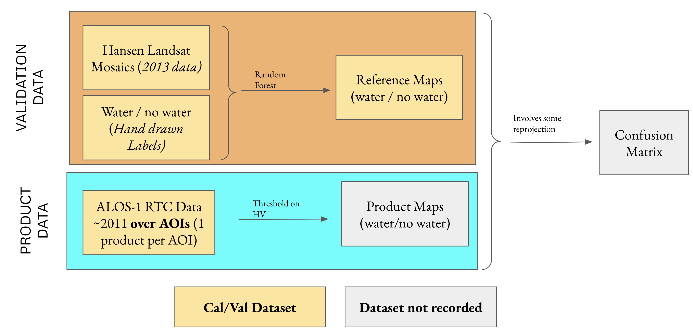

# Cal-Val-Example

This repository is meant to demonstrate how to organize validation data and activities on AWS and github.

# Organization

1. Creation of Cal/Val Datasets in the schematic
   + geojson with relevant metadata and urls to measurement/images
   + storing data on s3
2. Processing of datasets and validation activities

The generation of the Confusion matrix is meant to represent the final validation of requirements.


# Installation

Anaconda python and then install [mamba](https://github.com/mamba-org/mamba). Set up the environment.

```
mamba env create -f environment.yml
```

Then, `conda activate calval_env` and install the kernel for jupyter with `python -m ipykernel install --user --name
calval_env`.

# Basic Mock Up

We are going to do a very basic water/no-water analysis over 3 deltas along the Gulf-coast comparing them to similar maps made from LANDSAT (thanks Matt Hansen!)

1. [Wax Lake](https://en.wikipedia.org/wiki/Wax_Lake)
2. [Atchafalaya](https://en.wikipedia.org/wiki/Atchafalaya_Basin)
3. [Mobile-Tensaw](https://en.wikipedia.org/wiki/Mobile%E2%80%93Tensaw_River_Delta)


Below, the diagram is roughly the schematic of what we will be demonstrating in this repo.



Technically, the product data should be available from the OPERA Product API. However, this is an exercise to provide the team a clear example of how to interact with the data.

## Steps

*Important note*: if running this on a local workstation with non-enterprise connectivity, the notebooks download/upload time will be *slow* (e.g. files in this example are upwards of 5 GB; on my home internet, uploading to an s3 bucket took about 1.25 hours). It is highly recommended to run these examples on a machine with high connectivity to ensure downloads/uploads are highly efficient.

1. Create `datasets/aois` with `QGIS` and its vector drawing tools to cover the areas above. See the resulting geojsons [here](datasets/aois.geojson).
2. Create an s3 bucket called `calval-metadata` in s3. Do not modify any default settings during bucket creation (i.e. use default settings across the board).
3. Generate AWS credentials (credentials last for only a few hours) with these [instructions](https://github.jpl.nasa.gov/cloud/Access-Key-Generation/blob/master/python-README.md); this will require JPL VPN to access the repository and to generate the proper credentials. You will clone and presumably have most of the libraries (may have to install). I just ran `python aws-python.py` without changing the file permissions and that was fine. If you are apart of more than one AWS account, you will be prompted to select the proper role.
4. Organize the landsat mosaics as [here](datasets/0_Organize_Hansen_Landsat_Mosaics.ipynb).
5. We have to crop the mosaics to perform classification - they are distributed in squares with width 40,000 pixel. Lots of GIS and re-uploading is done in the subsequent [notebook](datasets/1_Crop_Mosaics_and_Re-upload.ipynb).
6. We demonstrate downloading from Cal/Val database as [here](datasets/2_Download_Hansen_Validation_Dataset.ipynb). The data can then be viewed in QGIS, for example. Or just to double check the metadata or measurements are correct. Here are a metadata geojsons: [mosaics](datasets/test-prod--hansen-landsat-mosaics-2020.geojson) and [cropped mosaics](datasets/test-prod--cropped-hansen-landsat-mosaics-2020.geojson).
7. Create "training data" `geosjon` (as in step 1.) using "land" and "water" labels in `QGIS`. See the resulting example [here](datasets/training_data.geojson).
8. Create Reference Map using (a) cropped landsat mosaic, (b) training data, and (c) random Forest in this [notebook](datasets/3_RF_Classification_for_Reference_Map.ipynb).
9. Get intersecting ALOS-products, generate a water mask from a threshold, and compare the data to our reference maps. Gets GIS intensive as indicated in this [notebook](datasets/4_ALOS1_Water_Mask_And_Comparison.ipynb).